## Journal articles

|        |  |
|   :-:    | -       |
| 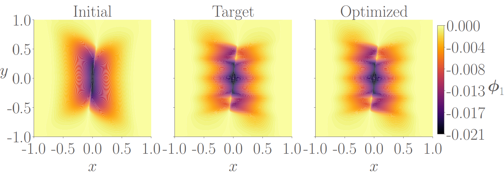 | Rohit Sunil Kanchi, __Sicheng He__.     [__Modal-Centric Field Inversion via Differentiable Proper Orthogonal Decomposition__](https://arxiv.org/abs/2601.14858)     _Journal of Computational Physics (major revision submitted)_ (2026).|
| 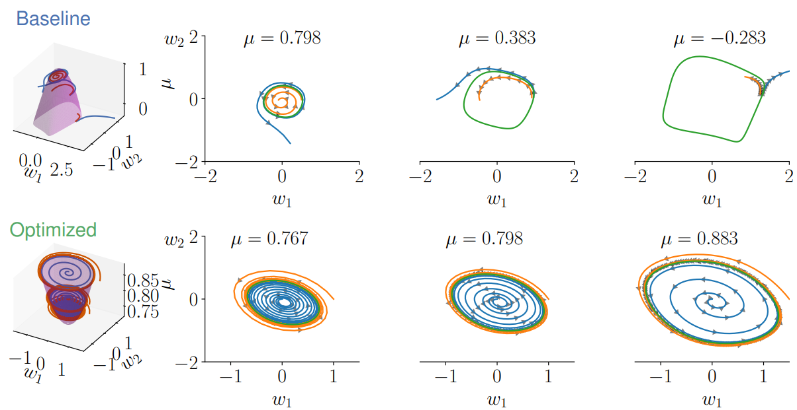 | __Sicheng He__, Max Howell, Daning Huang, Eirikur Jonsson, Galen W. Ng, Joaquim R. R. A. Martins.     [__Adjoint-based Hopf-bifurcation Instability Suppression via First Lyapunov Coefficient__](https://arxiv.org/abs/2511.03840)     _AIAA Journal (major revision)_ (2025).|
| 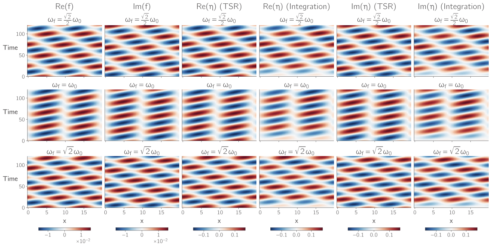 | Max Howell, __Sicheng He__.     [__Time-Spectral Resolvent Analysis for Periodic Dynamical Systems__](https://arxiv.org/abs/2602.15194)     _SIAM Journal on Applied Dynamical Systems (submitted)_ (2026).|
| 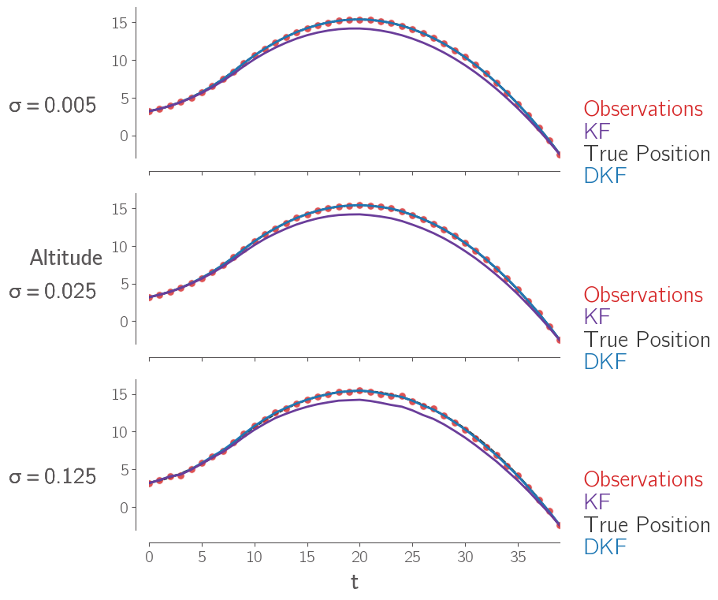 | Yuan Wu, __Sicheng He__.     [__DKFNet: Differentiable Kalman Filter for Field Inversion and Machine Learning__](https://arxiv.org/abs/2509.07474)     _Journal of Computational Physics (under review)_ (2025).|
| 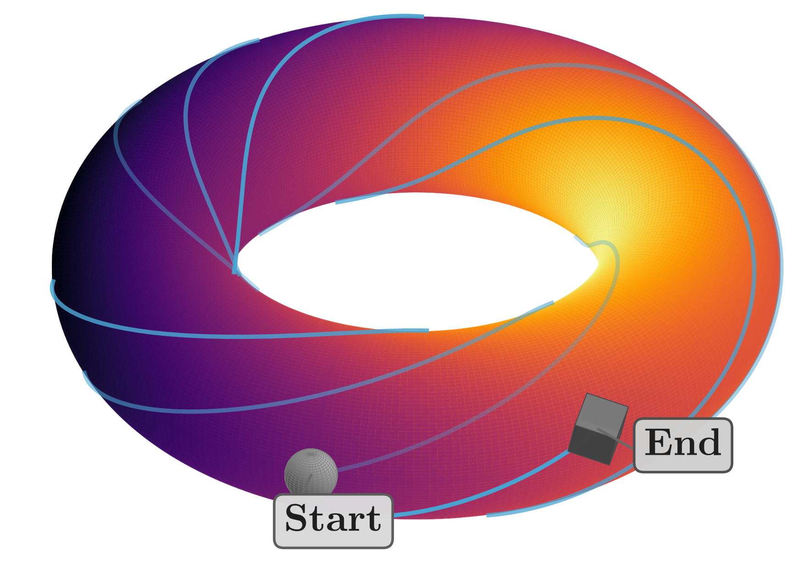 | __Sicheng He__, Hang Li, Kivanc Ekici.     [__Torus Time-Spectral Method for Quasi-Periodic Problems__](https://arxiv.org/abs/2512.13631)     _arXiv preprint_ (2025).|
| 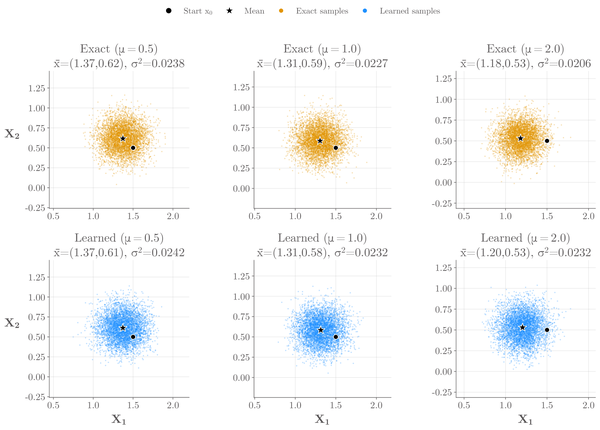 | Minglei Yang, __Sicheng He__.     [__Training-Free Score-Based Diffusion for Parameter-Dependent Stochastic Dynamical Systems__](https://doi.org/10.3934/acse.2026005)     _Advances in Computational Science and Engineering_ (2026).|
|  | Jianing Chen, Yan Li, __Sicheng He__, Daning Huang.     [__Eigenvalue- and Gradient-Aware Optimization for Small-Signal Stability via the Adjoint Method__](https://doi.org/10.1109/TPWRS.2026.3725599)     _IEEE Transactions on Power Systems_ (2026).|
| 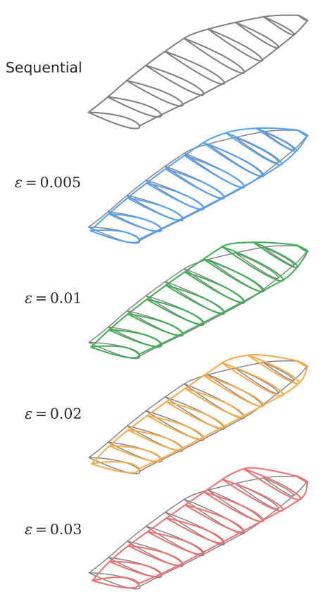 | __Sicheng He__, Shugo Kaneko, Max Howell, Nan Li, Joaquim R. R. A. Martins.     [__Efficient Adjoint-based Design Optimization with Optimal Control__](https://www.researchgate.net/publication/398712239_Efficient_Adjoint-based_Design_Optimization_with_Optimal_Control)     _Journal of Mechanical Design (accepted)_ (2026).|
| 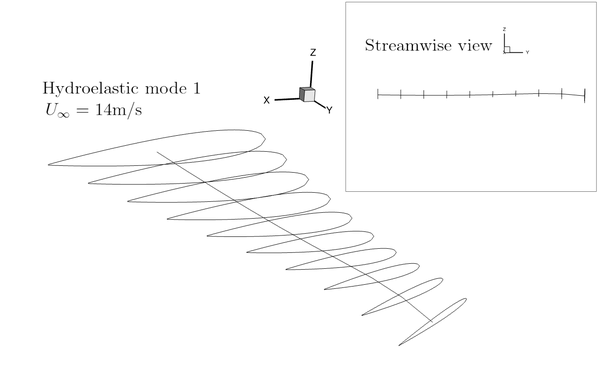 | Galen W. Ng, Shugo Kaneko, Eirikur Jonsson, __Sicheng He__, Joaquim R. R. A. Martins.     __Hydroelastic Optimization of Submerged Composite Foils with Flutter and Ventilation Constraints__     _Structural and Multidisciplinary Optimization (accepted)_ (2026).|
| 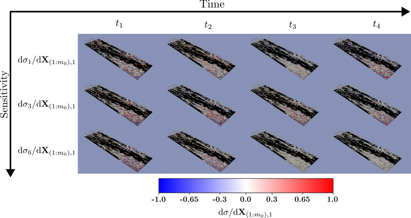 | Rohit Sunil Kanchi, __Sicheng He__.     [__Differentiable singular value decomposition (SVD)__](https://doi.org/10.1016/j.ymssp.2025.112817)     _Mechanical Systems and Signal Processing_ (2025).|
|  | Prakash Prashanth, Nicolas Gomez-Vega, __Sicheng He__, Aditeya Shukla, Jonas J. Gonzalez, Diego Salgado Bobadilla, Kanghyun Lee, Prateek Ranjan, Sayed Shayan Zahid, James Abel, Mark Drela, Raymond Speth.     [__TASOPT.jl: A Julia Package for Conceptual Commercial Transport Aircraft Design__](https://doi.org/10.21105/joss.08521)     _Journal of Open Source Software_ (2025).|
|  | Marco Mangano, __Sicheng He__, Yingqian Liao, Denis-Gabriel Caprace, Andrew Ning, Joaquim R. R. A. Martins.     [__Wind Turbine Rotor Design Using High-Fidelity Aerostructural Optimization__](https://doi.org/10.2514/1.J064556)     _AIAA Journal_ (2025).|
|  | Galen W. Ng, Eirikur Jonsson, __Sicheng He__, Joaquim R. R. A. Martins.     [__Dynamic Hydroelasticity of Composite Appendages with Reverse-Mode Algorithmic Differentiation__](https://doi.org/10.1016/j.compstruct.2024.118367)     _Composite Structures_ (2024).|
| 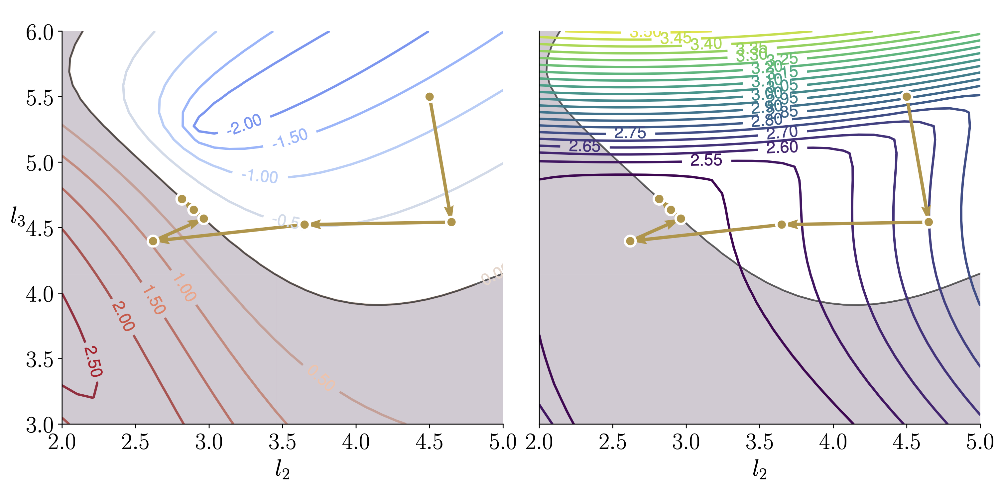 | __Sicheng He__, Eirikur Jonsson, Jichao Li, Joaquim R. R. A. Martins.     [__Adjoint-Based Design Optimization of Stability Constrained Systems__](https://arc.aiaa.org/doi/10.2514/1.J064273)     _AIAA Journal_ (2024).|
|  | Jichao Li, __Sicheng He__, Joaquim R. R. A. Martins, Mengqi Zhang, Boo Cheong Khoo.     [__Efficient Data-Driven Off-Design Constraint Modeling for Practical Aerodynamic Shape Optimization__](https://doi.org/10.2514/1.J062629)     _AIAA Journal_ (2023).|
| 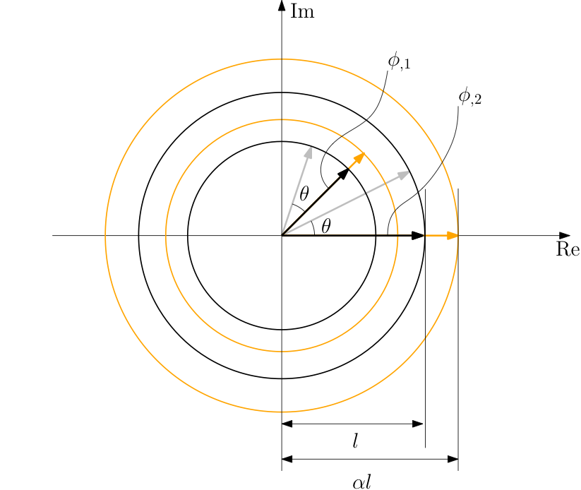 | __Sicheng He__, Yayun Shi, Eirikur Jonsson, Joaquim R. R. A. Martins.     [__Eigenvalue problem derivatives computation for a complex matrix using the adjoint method__](https://www.researchgate.net/publication/362931690_Eigenvalue_problem_derivatives_computation_for_a_complex_matrix_using_the_adjoint_method)     _Mechanical Systems and Signal Processing_ (2023).|
| 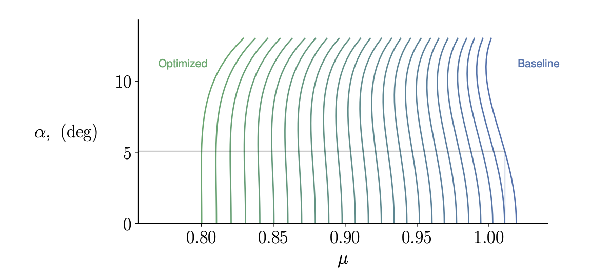 | __Sicheng He__, Eirikur Jonsson, Joaquim R. R. A. Martins.     [__Adjoint-based Limit Cycle Oscillation Instability Sensitivity and Suppression__](https://www.researchgate.net/publication/363581644_Adjoint-based_Limit_Cycle_Oscillation_Instability_Sensitivity_and_Suppression)     _Nonlinear dynamics_ (2022).|
| 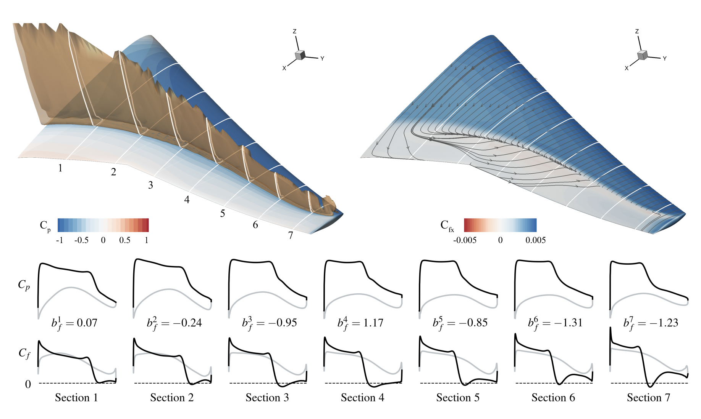 | Jichao Li, __Sicheng He__, Mengqi Zhang, Joaquim R. R. A. Martins, Boo Cheong Khoo.     [__Physics-Based Data-Driven Buffet-Onset Constraint for Aerodynamic Shape Optimization__](https://arc.aiaa.org/doi/10.2514/1.J061519)     _AIAA Journal_ (2022).|
| 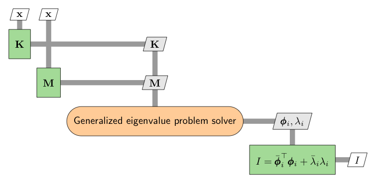 | __Sicheng He__, Eirikur Jonsson, and Joaquim R. R. A. Martins.     [__Derivatives for Eigenvalues and Eigenvectors via Analytic Reverse Algorithmic Differentiation__](https://arc.aiaa.org/doi/abs/10.2514/1.J060726?journalCode=aiaaj)     _AIAA Journal_ (2022).|
| 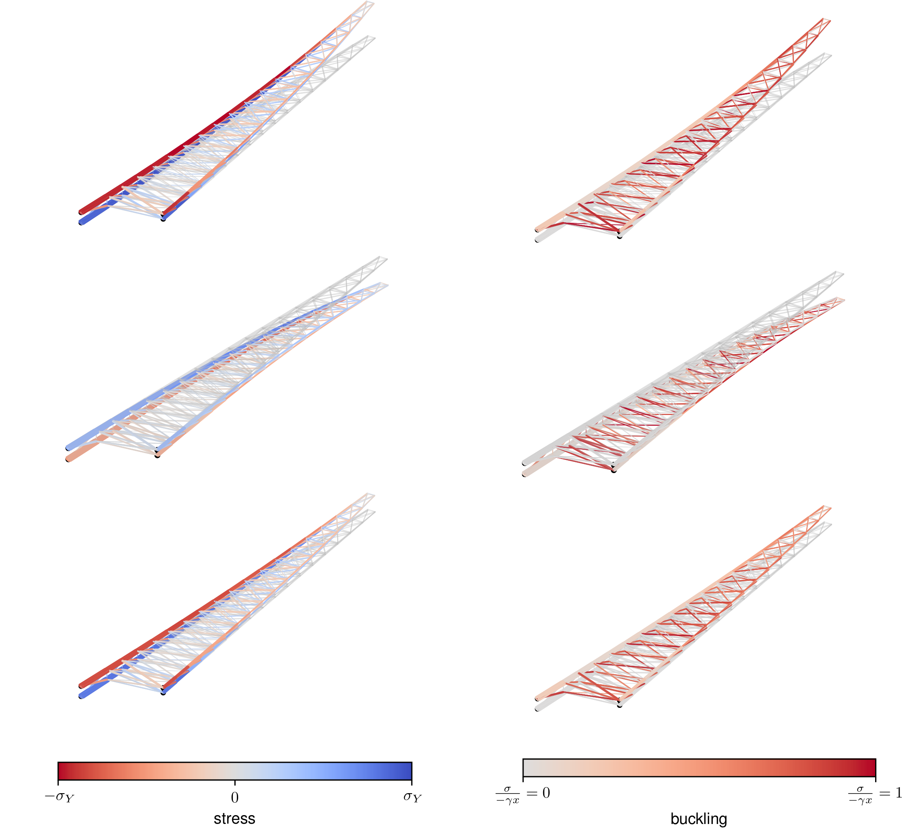 | Ramin Fakhimi, Mohammad Shahabsafa, Weiming Lei, __Sicheng He__, Joaquim R. R. A. Martins, Luis Zuluaga, and Tamas Terlaky.     [__Discrete multi-load truss sizing optimization: model analysis and computational experiments__](https://link.springer.com/article/10.1007/s11081-021-09672-6)     _Optimization and Engineering_ (2021).|
| 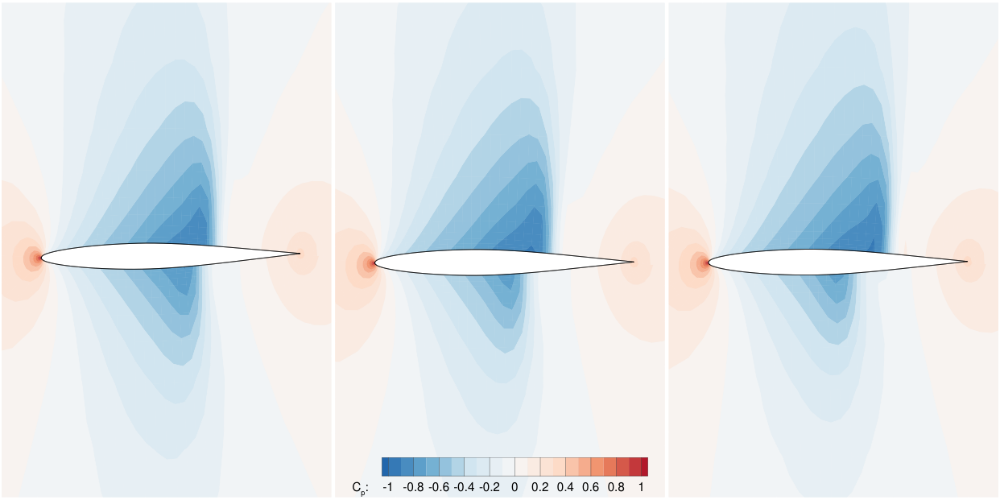 | __Sicheng He__, Eirikur Jonsson, Charles A. Mader, and Joaquim R. R. A. Martins.    [__Coupled Newton–Krylov timespectral solver for flutter and limit cycle oscillation prediction__](https://arc.aiaa.org/doi/10.2514/1.J059224)     _AIAA Journal_ (2021).|
| 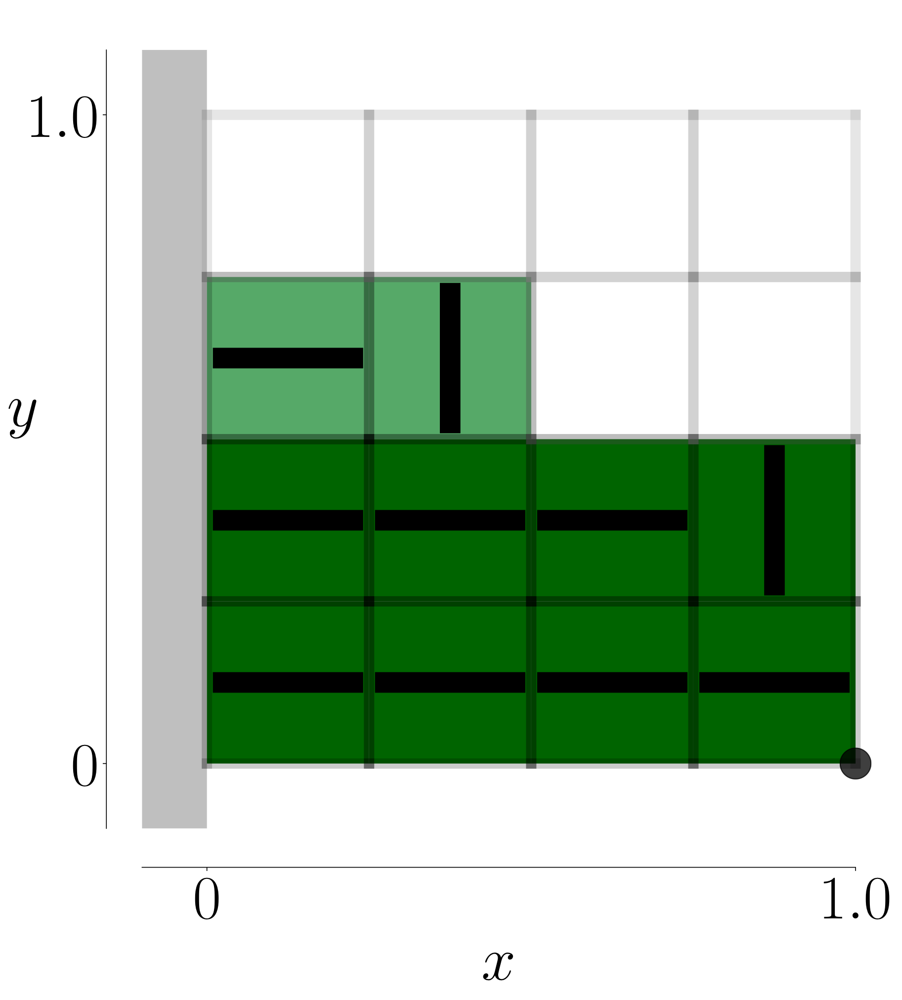 | __Sicheng He__, Mohammad Shahabsafa, Weiming Lei, Ali Mohammad-Nezhad, Tamas Terlaky, Luis Zuluaga, and Joaquim R. R. A. Martins.    [__Mixed-integer second-order cone optimization for composite discrete ply-angle and thickness topology optimization problems__](https://link.springer.com/article/10.1007/s11081-020-09573-0)     _Optimization and Engineering_ (2020).|
| 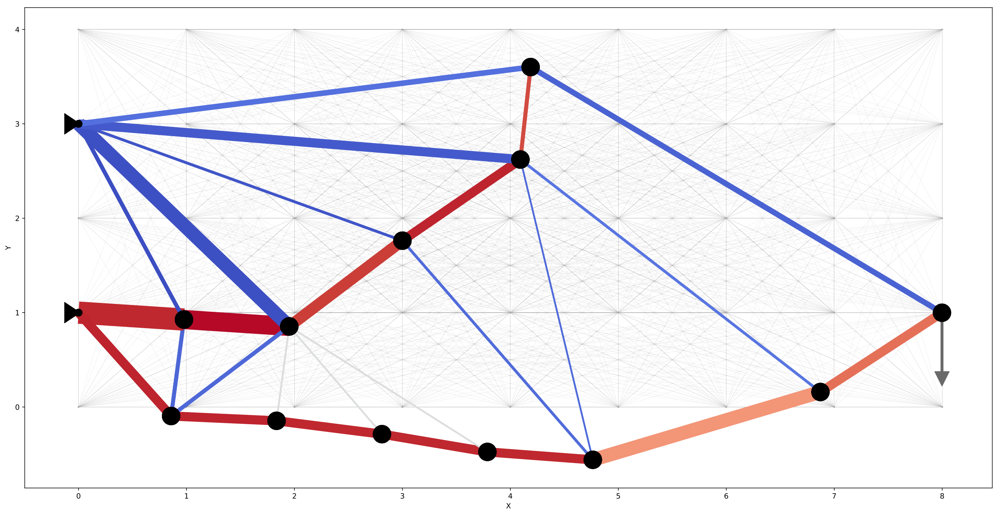 | Mohammad Shahabsafa, Ramin Fakhimi, Weiming Lei, __Sicheng He__, Luis Zuluaga, Joaquim R. R. A. Martins, and Tamas Terlaky.    [__Truss topology design and sizing optimization with guaranteed kinematic stability__](https://link.springer.com/article/10.1007/s00158-020-02698-x)     _Structural and Multidisciplinary Optimization_ (2020).|
| 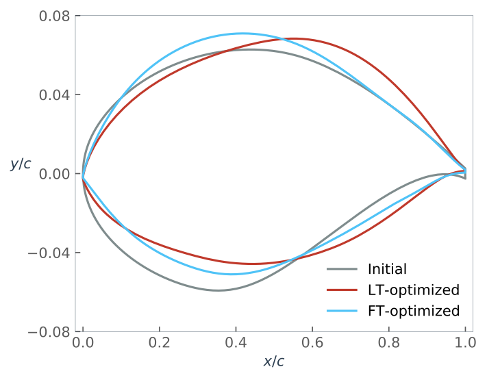 | Yayun Shi, Charles A. Mader, __Sicheng He__, Gustavo L. O. Halila, and Joaquim R. R. A. Martins.    [__Natural laminarflow airfoil optimization design using a discrete adjoint approach__](https://arc.aiaa.org/doi/10.2514/1.J058944s)     _AIAA Journal_ (2020).|
| 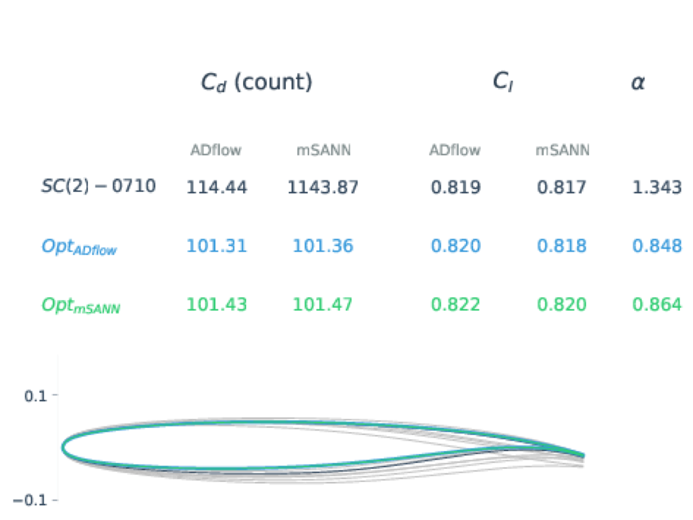 | Mohamed Amine Bouhlel, __Sicheng He__, and Joaquim R. R. A. Martins.    [__Scalable gradient-enhanced artificial neural networks for airfoil shape design in the subsonic and transonic regimes__](https://link.springer.com/article/10.1007/s00158-020-02488-5)     _Structural and Multidisciplinary Optimization_ (2020). (Webfoil)|
| 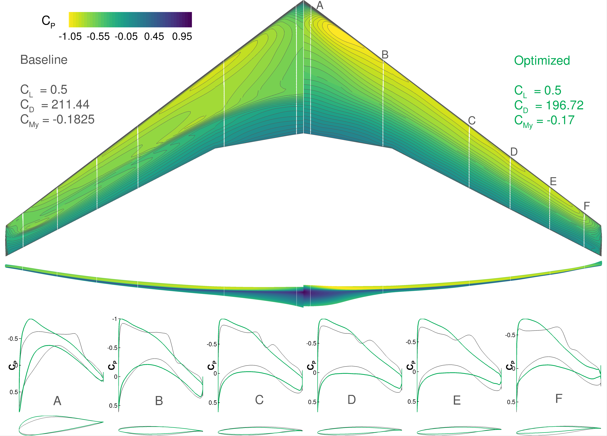 | Jichao Li, __Sicheng He__, and Joaquim R. R. A. Martins.    [__Data-driven constraint approach to ensure low-speed performance in transonic aerodynamic shape optimization__](https://www.sciencedirect.com/science/article/pii/S1270963819304912)     _Aerospace Science and Technology_ (2019).|
| 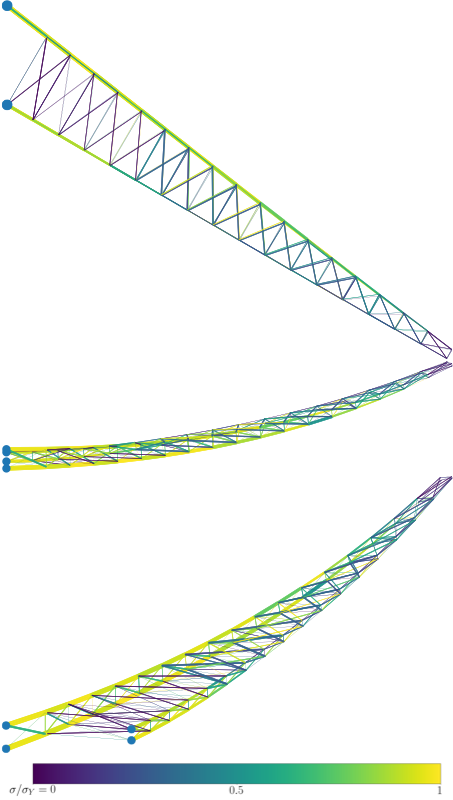 | Mohammad Shahabsafa, Ali Mohammad-Nezhad, Tamas Terlaky, Luis Zuluaga, __Sicheng He__, John T. Hwang, and Joaquim R. R. A. Martins.    [__A novel approach to discrete truss design problems using mixed integer neighborhood search__](https://link.springer.com/article/10.1007/s00158-018-2099-8)     _Structural and Multidisciplinary Optimization_ (2018).|

## Conference proceedings

|        |  |
|   :-:    | -       |  
| 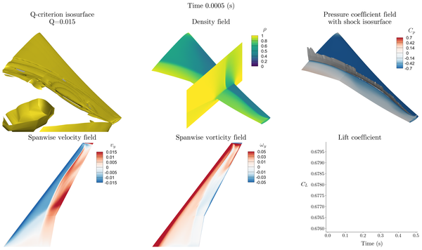 | Rohit Sunil Kanchi, __Sicheng He__, Eirikur Jonsson, Joaquim R. R. A. Martins.     [__Buffet Alleviation via Linear Stability Adjoint__](https://arxiv.org/abs/2605.04884)     _AIAA AVIATION Forum_ (2026). **2026 AIAA MDO Best Student Paper Runner-Up.**|
| 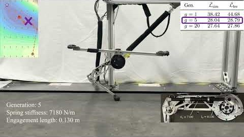 | Yulun Zhuang, Yue Qin, Justin Lu, Zelin Shen, Yichen Wang, __Sicheng He__, Yanran Ding.     [__SurGE: Surrogate Gradient-guided Evolution for Co-design of Legged Robots with Parallel Elasticity__](https://arxiv.org/abs/2606.21866)     _IEEE/RSJ International Conference on Intelligent Robots and Systems (IROS)_ (2026). [[Project page]](https://arcad-lab-um.github.io/surge-codesign/) [[Video]](https://youtu.be/Qr4zfAnQmRc)|
| 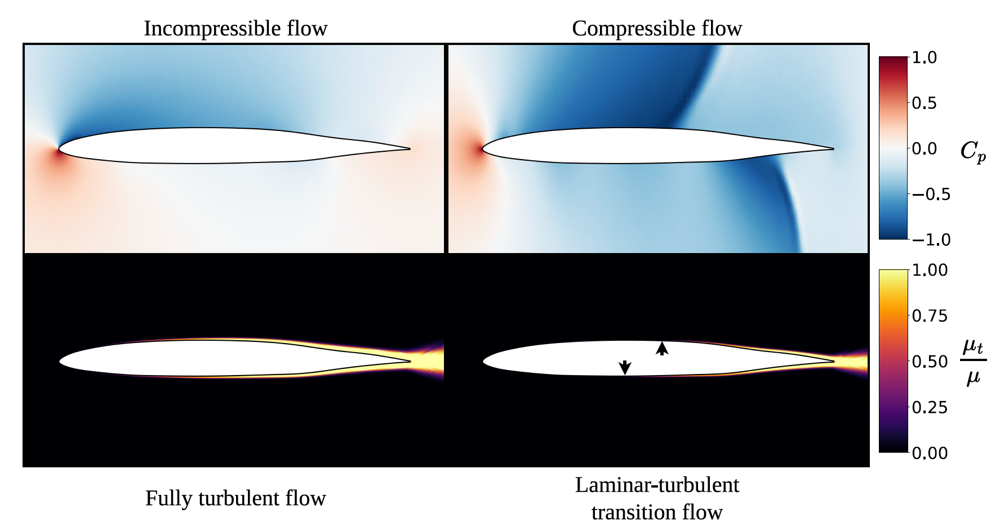 | Rohit Sunil Kanchi, Benjamin Melanson, Nithin Somasekharan, Shaowu Pan, __Sicheng He__.    [__UniFoil: A Universal Dataset of Airfoils in Transitional and Turbulent Regimes for Subsonic and Transonic Flows__](https://neurips.cc/virtual/2025/loc/san-diego/poster/121532).    _NeurIPS Dataset and Benchmark Track, San Diego, CA, December 2025_.|
| 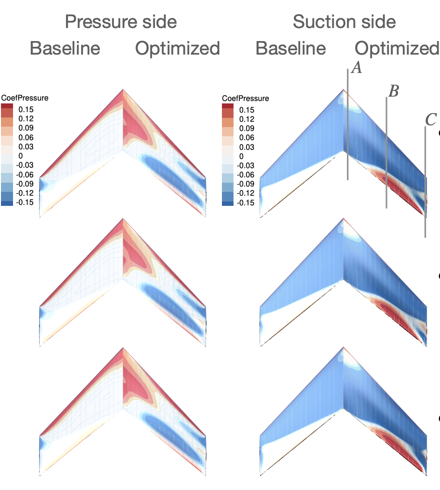 | __Sicheng He__, Eirikur Jonsson, Joaquim R. Martins.    [__Wing Aerodynamic Shape Optimization with Time Spectral Limit-Cycle Oscillation Adjoint__](https://arc.aiaa.org/doi/abs/10.2514/6.2022-3357).    _In AIAA Aviation, Chicago, IL, June 2022. American Institute of Aeronautics and Astronautics_.|
| 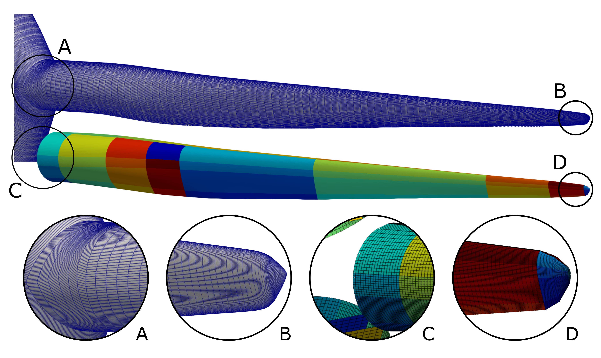 | Denis-Gabriel Caprace, Adam Cardoza, Teagan Nakamoto, Andrew Ning, Marco Mangano, __Sicheng He__, and Joaquim R. R. A. Martins.    [__Incorporating high-fidelity aerostructural analyses in wind turbine rotor optimization__](https://arc.aiaa.org/doi/abs/10.2514/6.2022-1290).    _In AIAA Scitech, San Diego, CA, January 2022. American Institute of Aeronautics and Astronautics_.|
| 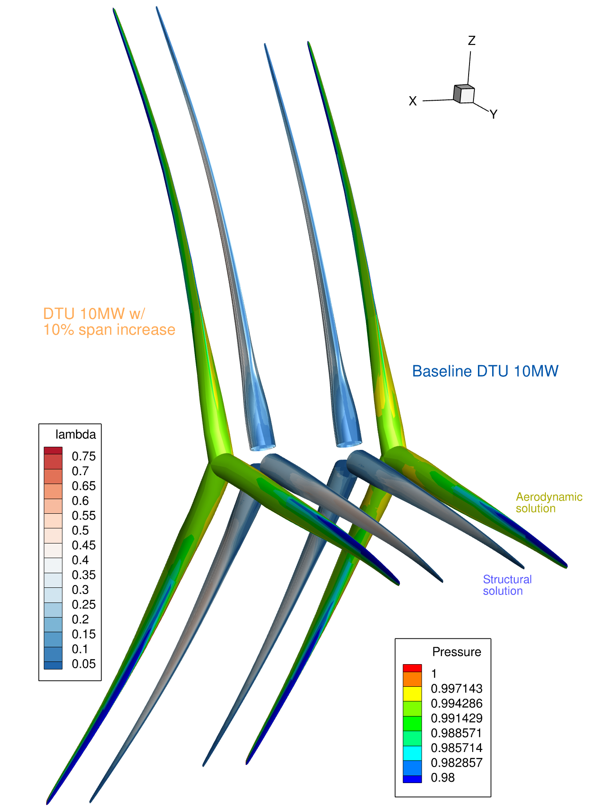 | Marco Mangano, __Sicheng He__, Denis-Gabriel Caprace, Yingqian Liao, and Joaquim R. R. A. Martins.    [__Passive aeroelastic tailoring of large wind turbines using high-fidelity multidisciplinary design optimization__](https://arc.aiaa.org/doi/abs/10.2514/6.2022-1289).    _In AIAA Scitech, San Diego, CA, January 2022. American Institute of Aeronautics and Astronautics_.|
| 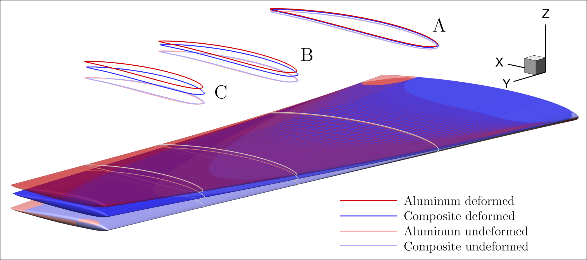 | Yingqian Liao, __Sicheng He__, Joaquim R. R. A. Martins, and Yin Lu Young.    [__Hydrostructural optimization of generic composite hydrofoils__](https://arc.aiaa.org/doi/10.2514/6.2020-0164).    _In AIAA SciTech Forum, Orlando, FL, January 2020. AIAA_.|
| 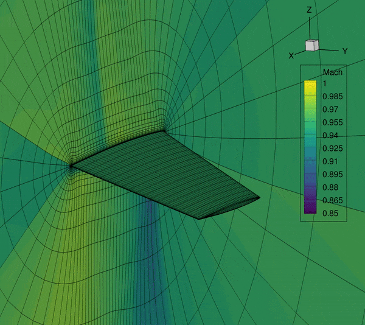 | __Sicheng He__, Eirikur Jonsson, Charles A. Mader, and Joaquim R. R. A. Martins.    [__A coupled Newton–Krylov time-spectral solver for wing flutter and LCO prediction__](https://arc.aiaa.org/doi/10.2514/6.2019-3549).    _In AIAA Aviation Forum, Dallas, TX, June 2019_. (Best student paper award, 2nd place)|
| 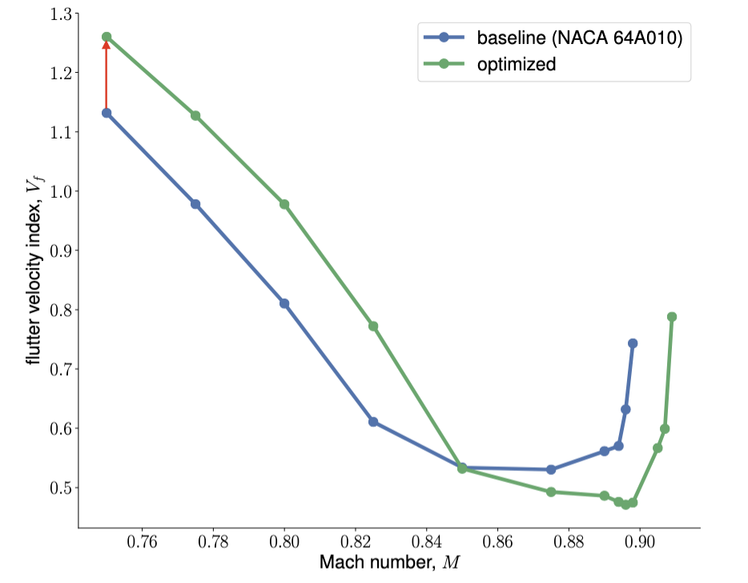 |__Sicheng He__, Eirikur Jonsson, Charles A. Mader, and Joaquim R. R. A. Martins.    [__Aerodynamic shape optimization with time spectral flutter adjoint__](https://arc.aiaa.org/doi/10.2514/6.2019-0697).    _In 2019 AIAA/ASCE/AHS/ASC Structures, Structural Dynamics, and Materials Conference, San Diego, CA, January 2019. American Institute of Aeronautics and Astronautics_.|
| 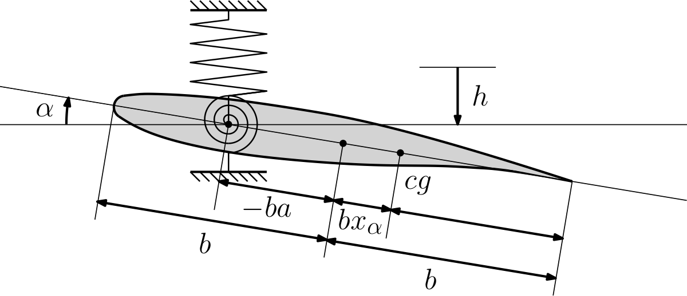 | __Sicheng He__, Eirikur Jonsson, Charles A. Mader, and Joaquim R. R. A. Martins.    [__A coupled Newton–Krylov time spectral solver for flutter prediction__](https://arc.aiaa.org/doi/10.2514/6.2018-2149).    _In 2018 AIAA/ASCE/AHS/ASC Structures, Structural Dynamics, and Materials Conference, Kissimmee, FL, January 2018. American Institute of Aeronautics and Astronautics_.|

## Thesis

|        |  |
|   :-:    | -       |  
| 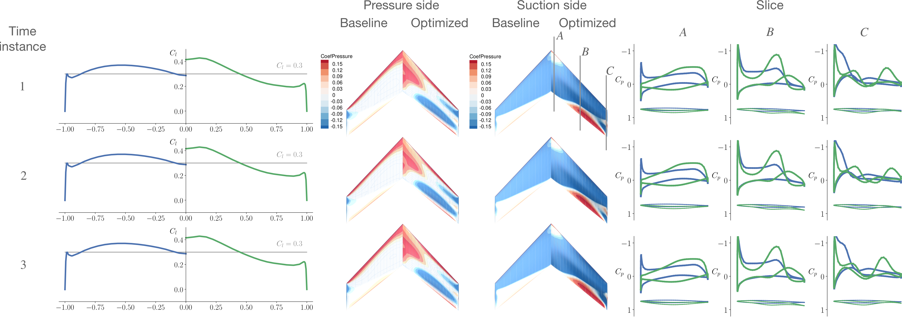 | __Sicheng He__. ["Aerodynamic Shape Optimization using a Time-Spectral Approach for Limit Cycle Oscillation Prediction."](https://deepblue.lib.umich.edu/handle/2027.42/167969) PhD diss., 2020.
