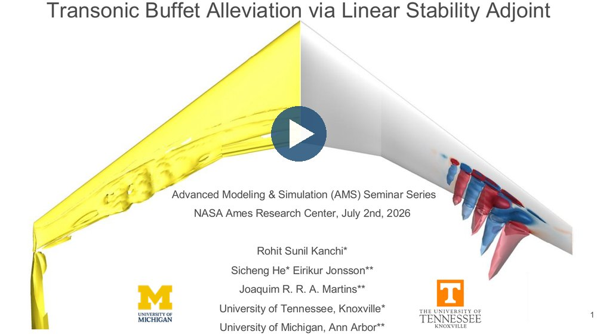
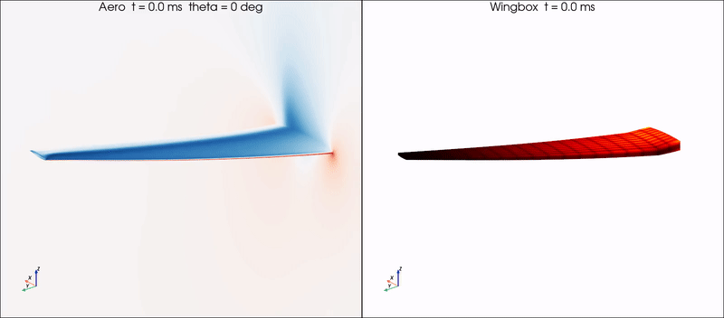
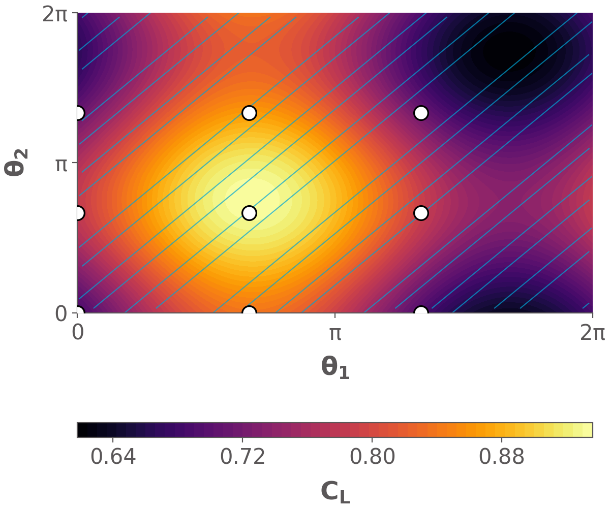
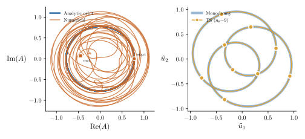
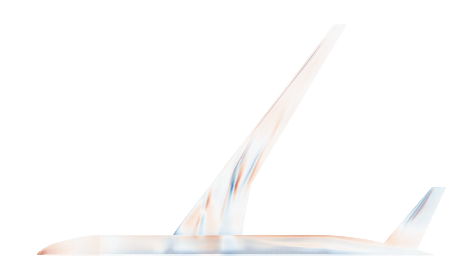
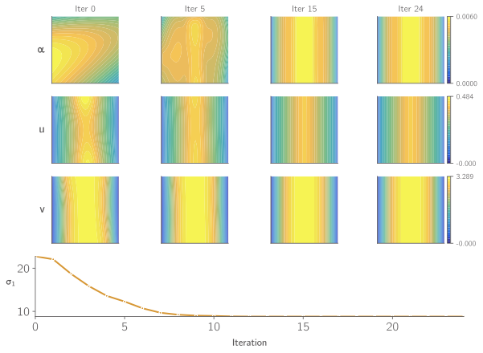
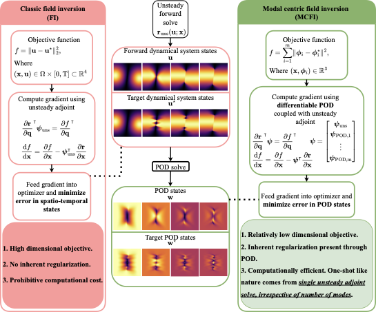
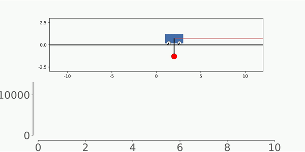
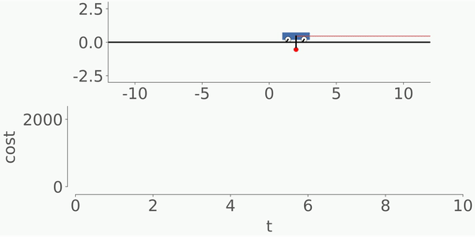
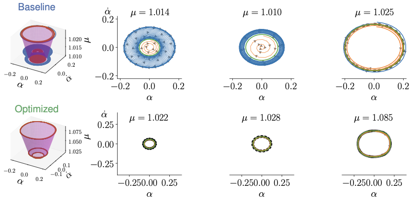

<strong>Our mission:</strong> To develop structured and differentiable representations of complex dynamical systems that enable scalable analysis, physical insight, and optimal design.

Our research is organized around three pillars: (1) **structured representations** of nonlinear dynamics, (2) **operator-theoretic analysis** and interpretable reduced coordinates, and (3) **optimization, control, and learning** of dynamical systems.

## Research highlight: transonic buffet

Transonic buffet—self-sustained shock and shear-layer oscillations—limits the cruise envelope of modern transport aircraft and emerges through a **Hopf bifurcation** of the steady flow.
Led by Ph.D. student Rohit Kanchi, we predict buffet onset from first principles with **linear stability analysis (LST)** of the steady base flow, and we developed a **coupled adjoint** that computes the sensitivity of the dominant LST eigenvalue with respect to a large number of shape design variables.
A buffet-constrained drag minimization of the OAT15A supercritical airfoil achieves a **22.4% drag reduction** while satisfying the LST-based buffet constraint.
This work received the **2026 AIAA MDO Best Student Paper Runner-Up** award.

We are extending the approach to three-dimensional buffet on swept wings.
The simulation below was computed using [ADflow](https://github.com/mdolab/adflow), a state-of-the-art RANS-based finite-volume solver, on NASA's [Common Research Model (CRM)](https://commonresearchmodel.larc.nasa.gov/) wing in the wing-only configuration, at **Mach 0.85**, **angle of attack 4.2 deg**, and **Reynolds number 5 million**.

<figure class="lab-figure">
  <video controls playsinline preload="metadata" poster="../images/research/transonic_buffet_3d_tile.png" style="width: 100%; max-width: 1100px; background: #000; border: 1px solid #d8d8d8; border-radius: 6px;">
    <source src="../assets/videos/transonic-buffet-3d-crm.mp4" type="video/mp4">
    Your browser does not support the video tag.
  </video>
  <figcaption>A tiled view of the 3D buffet dynamics on the CRM wing showing the Q-criterion isosurface, density, pressure coefficient with shock isosurface, spanwise velocity, spanwise vorticity, and lift-coefficient history.</figcaption>
</figure>

Rohit presented this work at the [NASA Ames Applied Modeling & Simulation (AMS) Seminar Series](https://www.nas.nasa.gov/pubs/ams/2026/07-02-26.html) on July 2, 2026 ([slides](https://www.nas.nasa.gov/assets/nas/pdf/ams/2026/AMS_20260702_Kanchi.pdf)).

<figure class="lab-figure">
  
  <figcaption>Watch the recording of &ldquo;Transonic Buffet Alleviation via Linear Stability Adjoint&rdquo; on the <a href="https://www.nas.nasa.gov/pubs/ams/2026/07-02-26.html" target="_blank">NASA Ames AMS seminar page</a> (July 2, 2026).</figcaption>
</figure>

__Publication:__

|        |  |
|   :-:    | -       |
|  | Rohit Sunil Kanchi, __Sicheng He__, Eirikur Jonsson, Joaquim R. R. A. Martins.     [__Buffet Alleviation via Linear Stability Adjoint__](https://arxiv.org/abs/2605.04884)     _AIAA AVIATION Forum_ (2026). **2026 AIAA MDO Best Student Paper Runner-Up.**|

## 1. Structured representations of nonlinear dynamics

<figure class="lab-figure">
  
  <figcaption>Forced periodic oscillation of a flexible wing computed with our coupled time-spectral aeroelastic solver, capturing the fluid–structure response in the frequency domain at a fraction of the cost of time marching.</figcaption>
</figure>

**How do we build compact, structured representations of nonlinear time-dependent dynamics?**

We develop spectral and frequency-domain frameworks that replace brute-force time marching with structure-exploiting representations of periodic and quasi-periodic behavior.
Our work follows a natural progression: **represent** the motion via time-spectral methods, **generalize** to multi-frequency motion via torus methods, and **characterize stability** of the represented motion via Floquet theory.

Key contributions include the **torus time-spectral method (TTSM)** that lifts governing equations to an extended angular phase space with **spectral convergence**, **spectral Floquet analysis** for orbital stability of periodic systems, **time-spectral resolvent analysis** for frequency response of periodically varying base flows, and the **first fully coupled CFD–FEA time-spectral aeroelastic solver** that captures forced periodic wing oscillations in the frequency domain at a **fraction of the cost** of time marching.

__Publication:__

|        |  |
|   :-:    | -       |
|  | __Sicheng He__, Hang Li, Kivanc Ekici.     [__Torus Time-Spectral Method for Quasi-Periodic Problems__](https://arxiv.org/abs/2512.13631)     _arXiv preprint_ (2025).|
|  | __Sicheng He__, Rohit Kanchi.     __Torus Time-Spectral Method for Three-Dimensional Wing Oscillations with Two Incommensurate Frequencies__     _in preparation_.|
|  | __Sicheng He__, Max Howell, Dan Wilson.     __Time-Spectral Method-Based Efficient Floquet Analysis__     _in preparation_.|
|  | Max Howell, __Sicheng He__.     [__Time-Spectral Resolvent Analysis for Periodic Dynamical Systems__](https://arxiv.org/abs/2602.15194)     _SIAM Journal on Applied Dynamical Systems (submitted)_ (2026).|
|  | __Sicheng He__.     __Coupled Time-Spectral Aeroelastic Analysis Using High-Fidelity CFD and Finite Element Structural Models__     _in preparation_.|

## 2. Operator-theoretic analysis and interpretable reduced coordinates

<figure class="lab-figure">
  
  <figcaption>Velocity resolvent response mode on the NASA Common Research Model wing, computed using our matrix-free resolvent analysis framework.</figcaption>
</figure>

**How do we extract the dominant mechanisms, coordinates, and sensitivities from large-scale nonlinear systems?**

We build modal and operator-based tools to turn simulation data or linearized operators into understanding: what modes matter, what forcing/response structures dominate, and how sensitivities propagate through modal objects.
Critically, our analysis tools are not passive diagnostics—they are made **optimization-ready** through differentiable formulations that connect directly to gradient-based design.

Key contributions include the first **fully matrix-free resolvent analysis** for 3D aerodynamic systems (NASA CRM, **1.8 million cells**), **differentiable resolvent analysis** for flow control optimization, and **differentiable POD** for optimization-compatible modal decompositions and field inversion.

__Publication:__

|        |  |
|   :-:    | -       |
|  | __Sicheng He__, Rohit Kanchi.     __Matrix-Free Resolvent Analysis for Large-Scale Aerodynamic Systems__     _in preparation_.|
|  | __Sicheng He__, Shugo Kaneko, Daning Huang, Chi-An Yeh, Joaquim R. R. A. Martins.     __Large-Scale Flow Control Performance Optimization via Differentiable Resolvent Analysis__     _in preparation_.|
|  | Rohit Sunil Kanchi, __Sicheng He__.     [__Modal-Centric Field Inversion via Differentiable Proper Orthogonal Decomposition__](https://arxiv.org/abs/2601.14858)     _Journal of Computational Physics (major revision submitted)_ (2026).|

## 3. Optimization, control, and learning of dynamical systems

**How do we control, optimize, and learn within structured dynamical representations?**

Once dynamics are represented and interpreted, we ask: how do we modify them—suppress instability, improve performance, learn closures, and design systems with dynamics as first-class constraints?
We combine adjoint methods, multidisciplinary optimization, and scientific machine learning to design, stabilize, and infer complex engineering systems governed by multiscale dynamics.

Key contributions include adjoint-based **stability-constrained design optimization**, **Hopf-bifurcation instability suppression** via the first Lyapunov coefficient, adjoint-based **control co-design**, including **co-design of legged robots** with parallel elasticity, a **fundamental** reverse algorithmic differentiation method for complex analytic functions yielding the **first succinct eigenvalue derivative formula for general complex matrices**, gradient-enhanced **neural network surrogates** for real-time aerodynamic analysis ([Webfoil](http://webfoil.engin.umich.edu/)), the **differentiable Kalman filter** for physics-informed state estimation with **90% error reduction**, and the **UniFoil** dataset of 500,000 airfoil simulations for scientific machine learning.

<figure class="lab-figure">
  

    <iframe width="800" height="450" src="https://www.youtube-nocookie.com/embed/Qr4zfAnQmRc?rel=0" title="SurGE: co-design of legged robots with parallel elasticity" allow="accelerometer; clipboard-write; encrypted-media; gyroscope; picture-in-picture" allowfullscreen loading="lazy"></iframe>
  

  <figcaption>SurGE co-designs the parallel spring of a hopping robot with surrogate gradients from a differentiable dynamics and control pipeline; on hardware it reduces the design objective by 37.65% (IROS 2026, with Yanran Ding's <a href="https://sites.google.com/umich.edu/arcad-lab/">ARCaD Lab</a> at the University of Michigan).</figcaption>
</figure>

<figure class="lab-figure">
  

    
    
  

  <figcaption>Baseline (left) and optimized (right).</figcaption>
</figure>

__Publication:__

|        |  |
|   :-:    | -       |
|  | Yulun Zhuang, Yue Qin, Justin Lu, Zelin Shen, Yichen Wang, __Sicheng He__, Yanran Ding.     [__SurGE: Surrogate Gradient-guided Evolution for Co-design of Legged Robots with Parallel Elasticity__](https://arxiv.org/abs/2606.21866)     _IEEE/RSJ International Conference on Intelligent Robots and Systems (IROS)_ (2026). [[Project page]](https://arcad-lab-um.github.io/surge-codesign/) [[Video]](https://youtu.be/Qr4zfAnQmRc)|
|  | Minglei Yang, __Sicheng He__.     [__Training-Free Score-Based Diffusion for Parameter-Dependent Stochastic Dynamical Systems__](https://doi.org/10.3934/acse.2026005)     _Advances in Computational Science and Engineering_ (2026).|
|  | Jianing Chen, Yan Li, __Sicheng He__, Daning Huang.     [__Eigenvalue- and Gradient-Aware Optimization for Small-Signal Stability via the Adjoint Method__](https://doi.org/10.1109/TPWRS.2026.3725599)     _IEEE Transactions on Power Systems_ (2026).|
|  | __Sicheng He__, Shugo Kaneko, Max Howell, Nan Li, Joaquim R. R. A. Martins.     [__Efficient Adjoint-based Design Optimization with Optimal Control__](https://www.researchgate.net/publication/398712239_Efficient_Adjoint-based_Design_Optimization_with_Optimal_Control)     _Journal of Mechanical Design (accepted)_ (2026).|
|  | Galen W. Ng, Shugo Kaneko, Eirikur Jonsson, __Sicheng He__, Joaquim R. R. A. Martins.     __Hydroelastic Optimization of Submerged Composite Foils with Flutter and Ventilation Constraints__     _Structural and Multidisciplinary Optimization (accepted)_ (2026).|
|  | Rohit Sunil Kanchi, Benjamin Melanson, Nithin Somasekharan, Shaowu Pan, __Sicheng He__.     [__UniFoil: A Universal Dataset of Airfoils in Transitional and Turbulent Regimes for Subsonic and Transonic Flows__](https://arxiv.org/abs/2505.21124)     _NeurIPS Datasets and Benchmarks Track_ (2025).|
|  | __Sicheng He__, Max Howell, Daning Huang, Eirikur Jonsson, Galen W. Ng, Joaquim R. R. A. Martins.     [__Adjoint-based Hopf-bifurcation Instability Suppression via First Lyapunov Coefficient__](https://arxiv.org/abs/2511.03840)     _AIAA Journal (major revision)_ (2025).|
|  | Yuan Wu, __Sicheng He__.     [__DKFNet: Differentiable Kalman Filter for Field Inversion and Machine Learning__](https://arxiv.org/abs/2509.07474)     _Journal of Computational Physics (under review)_ (2025).|
|  | __Sicheng He__, Eirikur Jonsson, Jichao Li, Joaquim R. R. A. Martins.     [__Adjoint-Based Design Optimization of Stability Constrained Systems__](https://arc.aiaa.org/doi/10.2514/1.J064273)     _AIAA Journal_ (2024).|
|  | __Sicheng He__, Eirikur Jonsson, Joaquim R. R. A. Martins.     [__Adjoint-based Limit Cycle Oscillation Instability Sensitivity and Suppression__](https://www.researchgate.net/publication/363581644_Adjoint-based_Limit_Cycle_Oscillation_Instability_Sensitivity_and_Suppression)     _Nonlinear dynamics_ (2022).|
|  | __Sicheng He__, Yayun Shi, Eirikur Jonsson, Joaquim R. R. A. Martins.     [__Eigenvalue problem derivatives computation for a complex matrix using the adjoint method__](https://www.researchgate.net/publication/362931690_Eigenvalue_problem_derivatives_computation_for_a_complex_matrix_using_the_adjoint_method)     _Mechanical Systems and Signal Processing_ (2023).|
|  | __Sicheng He__, Eirikur Jonsson, and Joaquim R. R. A. Martins.     [__Derivatives for Eigenvalues and Eigenvectors via Analytic Reverse Algorithmic Differentiation__](https://arc.aiaa.org/doi/abs/10.2514/1.J060726?journalCode=aiaaj)     _AIAA Journal_ (2022).|
|  | Jichao Li, __Sicheng He__, Mengqi Zhang, Joaquim R. R. A. Martins, Boo Cheong Khoo.     [__Physics-Based Data-Driven Buffet-Onset Constraint for Aerodynamic Shape Optimization__](https://arc.aiaa.org/doi/10.2514/1.J061519)     _AIAA Journal_ (2022).|
|  | Mohamed Amine Bouhlel, __Sicheng He__, and Joaquim R. R. A. Martins.    [__Scalable gradient-enhanced artificial neural networks for airfoil shape design in the subsonic and transonic regimes__](https://link.springer.com/article/10.1007/s00158-020-02488-5)     _Structural and Multidisciplinary Optimization_ (2020). (Webfoil)|
|  | Jichao Li, __Sicheng He__, and Joaquim R. R. A. Martins.    [__Data-driven constraint approach to ensure low-speed performance in transonic aerodynamic shape optimization__](https://www.sciencedirect.com/science/article/pii/S1270963819304912)     _Aerospace Science and Technology_ (2019).|

[Past research projects](/past-research/) — aeroelastic optimization, wind turbine MDO, laminar-turbulent transition, structural global optimization.
